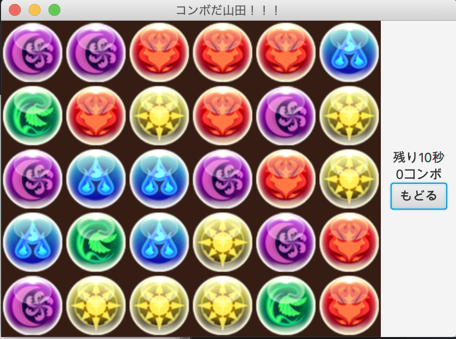

# javafxでパズドラ

<h2>遊び方</h2>

- ドロップを掴み動かし，縦もしくは横に連なった同色のドロップ3個以上のかたまりを作り，ドロップを消していく．

- ドロップが消えるごとにコンボが増える（コンボが多い方が良い）

<h2>雑談</h2>
- かつてのパズドラのCMで，山田の仲間が「コンボだ山田!!」と何度もエールを送り，山田くんが10コンボするシーンは未だに記憶している
